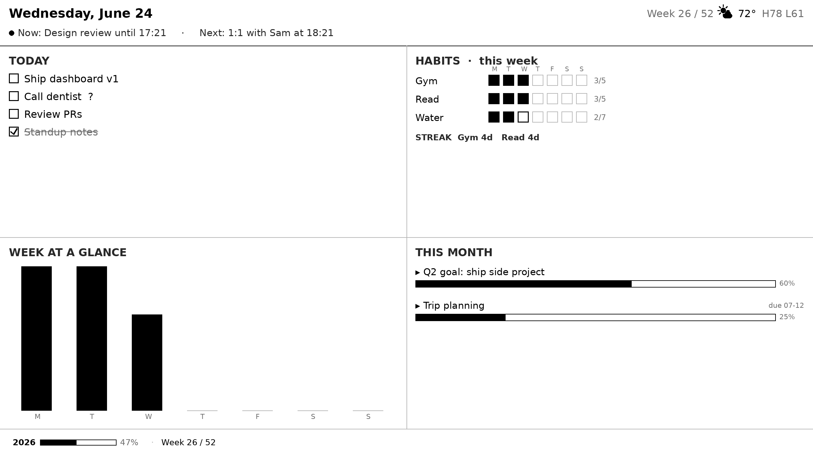

# eink-dashboard

A self-hosted **productivity magic mirror** for a 32" Boox e-ink monitor.

Write tasks in a paper notebook → photograph them with Meta Ray-Ban AI glasses →
AI extracts them → they appear on an always-on, glare-free e-ink dashboard showing
your **day / week / month** at a glance.

Fully self-hosted: a homelab server does all the work; a Raspberry Pi is a dumb
display client driving the Boox over HDMI.

> Full design: [`docs/plans/2026-06-10-eink-dashboard-design.md`](docs/plans/2026-06-10-eink-dashboard-design.md)
> Deploy on real hardware: [`docs/DEPLOYMENT.md`](docs/DEPLOYMENT.md)

## Architecture

```
notebook → 👓 glasses photo → 📱 phone → (Syncthing) → 🖥️ homelab server
                                                            │
                              watcher → classifier → router → extractors → store
                                                            │
                                          renderer → dashboard.png → api
                                                            │  (HTTP pull)
                                                            ▼
                                              🖥️ Raspberry Pi → HDMI → 📊 Boox 32"
```

## Layout

```
server/      Docker service: ingest photos, store state, render the dashboard PNG
  app/
    # --- core (Meta-agnostic) ---
    config.py         env-driven config
    store.py          SQLite + Markdown source of truth
    theme.py          fonts + grayscale palette
    renderer.py       compose widgets → grayscale PNG
    widgets/          pluggable dashboard zones (today, habits, week, month, extras)
    api.py            serve dashboard.png + a version number
    agenda.py         core Now/Next selection + header banner text
    weatherview.py    core: parse stored weather snapshot for the header
    weathericons.py   core: WMO code → drawn condition glyph
    # --- Meta AI glasses integration (kept separate) ---
    glasses/
      watcher.py      watch the synced photo folder
      classifier.py   vision AI: what kind of photo is this?
      router.py       route photo → extractor
      extractors/     photo type → structured records (tasks is the MVP)
      bot.py          voice/text write-back ("done: gym")
    # --- Calendar integration (kept separate) ---
    calendar/
      source.py       fetch + parse a personal .ics, expand recurrences
      sync.py         background poller → events in the store
    # --- Weather integration (kept separate) ---
    weather/
      source.py       resolve location (IP/manual) + fetch Open-Meteo
      sync.py         background poller → weather snapshot in the store
pi-client/   Runs on the Raspberry Pi: fetch the PNG, show it fullscreen
docs/        Design docs
data/        Runtime state (gitignored)
```

> **Note:** the optional integrations each live in their own package —
> `server/app/glasses/`, `server/app/calendar/`, `server/app/weather/`. The core
> never imports from any of them, so each can be swapped or removed without
> touching the dashboard.

## Status

🟢 **Phases 2–7 complete.**
- **Render path** — store → renderer → `dashboard.png`, served by the API.
- **Capture path** — `glasses/` watches the synced photo folder → vision AI
  classifies + extracts tasks → store → dashboard re-renders, version bumps.
- **Voice write-back** — `/bot` webhook accepts voice/text commands and updates
  the dashboard:
  - `add <task>` — add a task
  - `done <task or habit>` — check off a task (falls back to logging a habit)
  - `log <habit>` — log a habit for today

  Understands both a generic `{"text","sender"}` body and the WhatsApp Cloud API
  payload (with the verification handshake), so the glasses can drive it by voice.

- **Add-on widgets** — a time-awareness footer strip (year progress · week-of-year ·
  life lived) plus a selectable bottom-left zone via `BOTTOM_LEFT_WIDGET`:
  `week` (default) · `weekofyear` · `yearprogress` · `life` (life-in-weeks grid,
  needs `BIRTHDATE`).

- **Calendar (Now/Next banner)** — point `CALENDAR_ICS_URL` at a personal `.ics`
  and the header gains a `● Now: … · Next: …` line. Events are polled every 15 min,
  stored in UTC, and the screen only refreshes when the rendered image changes.
  Off by default (no URL = no banner, header unchanged). See `docs/plans/2026-06-24-calendar-integration-design.md`.

- **Weather** — the header shows a condition icon + current temp + today's high/low
  via Open-Meteo (no API key). Location auto-detects by IP, or set `WEATHER_LAT`/
  `WEATHER_LON`. On by default; falls back to a `--°` placeholder if unavailable.
  See `docs/plans/2026-06-24-weather-integration-design.md`.

Runs **without an API key** out of the box: set `VISION_PROVIDER=mock` (or leave
`ANTHROPIC_API_KEY` empty) and the pipeline uses canned vision results so you can
exercise the whole flow. Set a real key to read actual notebook photos.

Phases 2–7 are complete. 🎉



## Quick start (homelab server)

```bash
cp .env.example .env        # fill in vision AI key + paths
docker compose up -d --build
```

## Quick start (Raspberry Pi)

See [`pi-client/install.md`](pi-client/install.md).

## Phases

1. ✅ Skeleton (this repo)
2. ✅ Render path: store → PNG → api → Pi
3. ✅ Capture path: watcher → classifier → tasks extractor
4. ✅ Voice write-back bot
5. ✅ Add-on widgets (week-of-year, life-in-weeks, …)
6. ✅ Calendar integration (personal `.ics` → Now/Next header banner)
7. ✅ Weather (Open-Meteo → header icon + temp + high/low)
